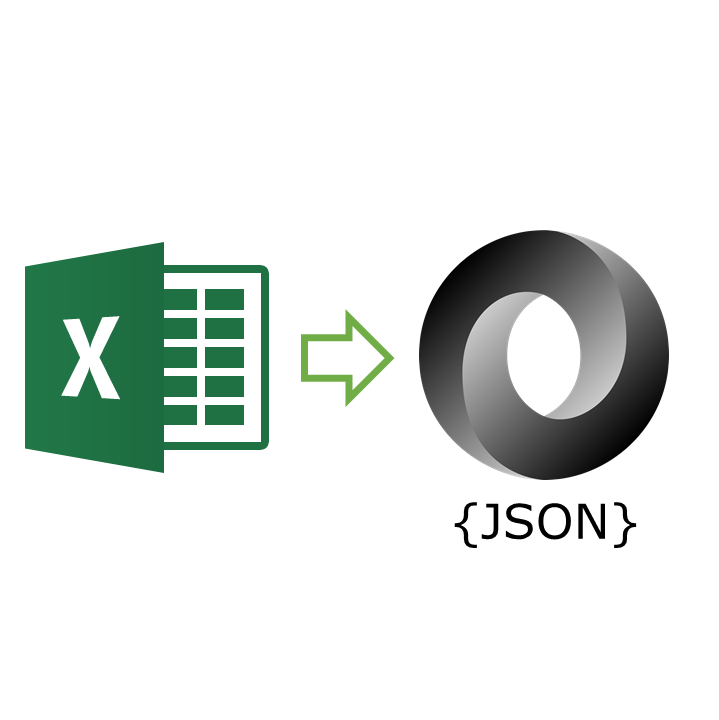
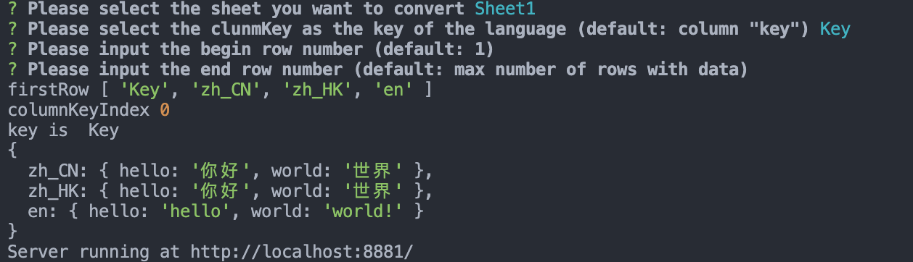

<p align="center">
    
</p>

## Why need this?
i18n messages is stored in Excel file, but it is not easy to edit in your code. So, this tool is created to convert Excel to JSON. 
## Features

Excel data structure is converted to JSON.
| Key | zh_CN | zh_HK | en | and more languages...
|:---|:---|:---|:---|:---|
| hello | 你好 | 你好 | hello | ... |
| world | 世界 | 世界 | world! | ... |

output JSON:

```json
{
   "zh_CN": {
        "hello": "你好",
        "world": "世界",
    },
    "zh_HK": {
        "hello": "你好",
         "world": "世界",
    },
    "en": {
        "hello": "hello",
         "world": "world!",
    }
}
```

## Installation

Using npm:

```sh
$ npm install -g excel-to-json
```

Using yarn:

```sh
$ yarn global add excel-to-json
```

## Usage

```sh
etj --sourceFile="example.xlsx"
```
## Examples

```sh
yarn example
```
<!--  -->

## Todo
* Add UI for configuring the output file options
* 无法解析在线文档导出的xlsx文件

## License

[MIT](https://en.wikipedia.org/wiki/MIT_License)

